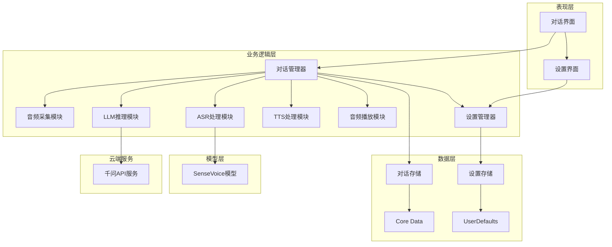
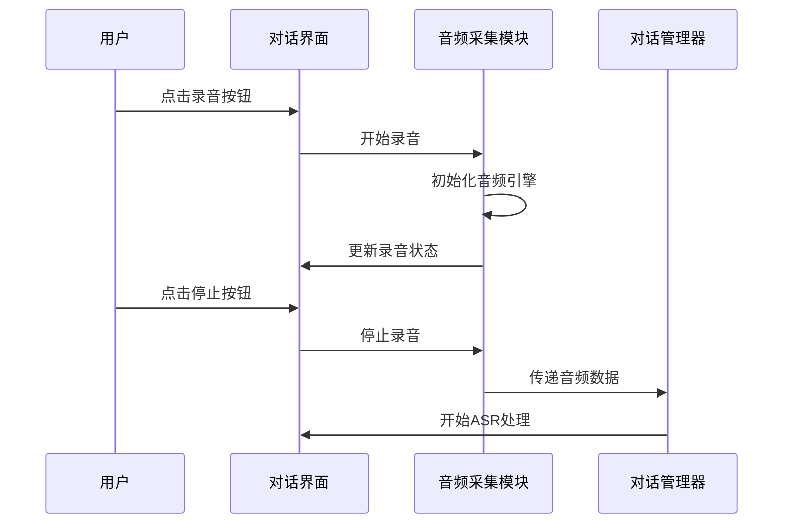
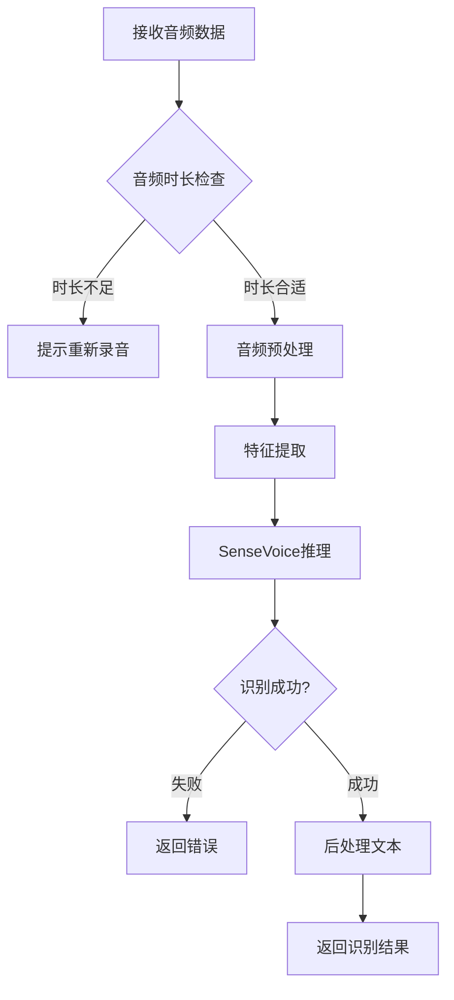
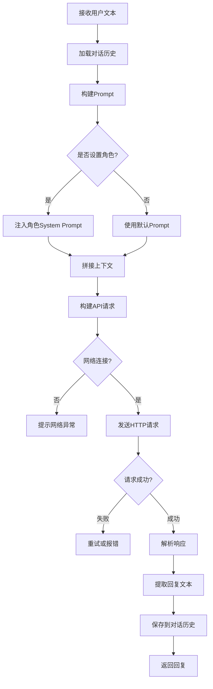
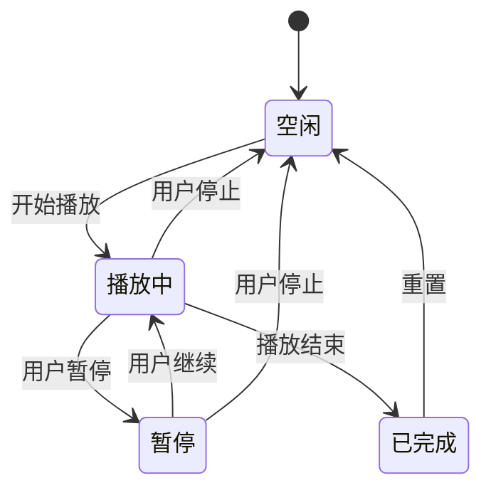
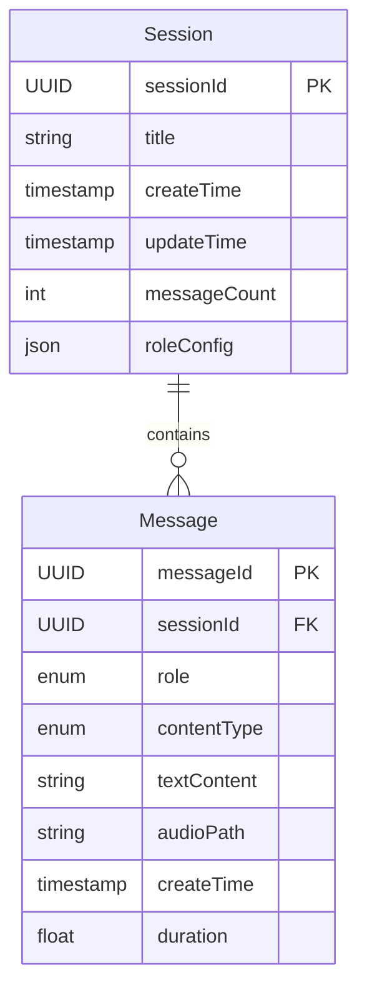
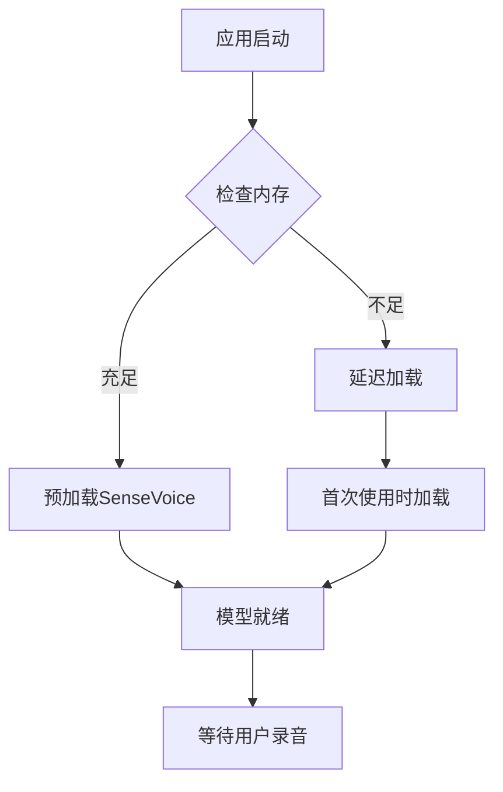
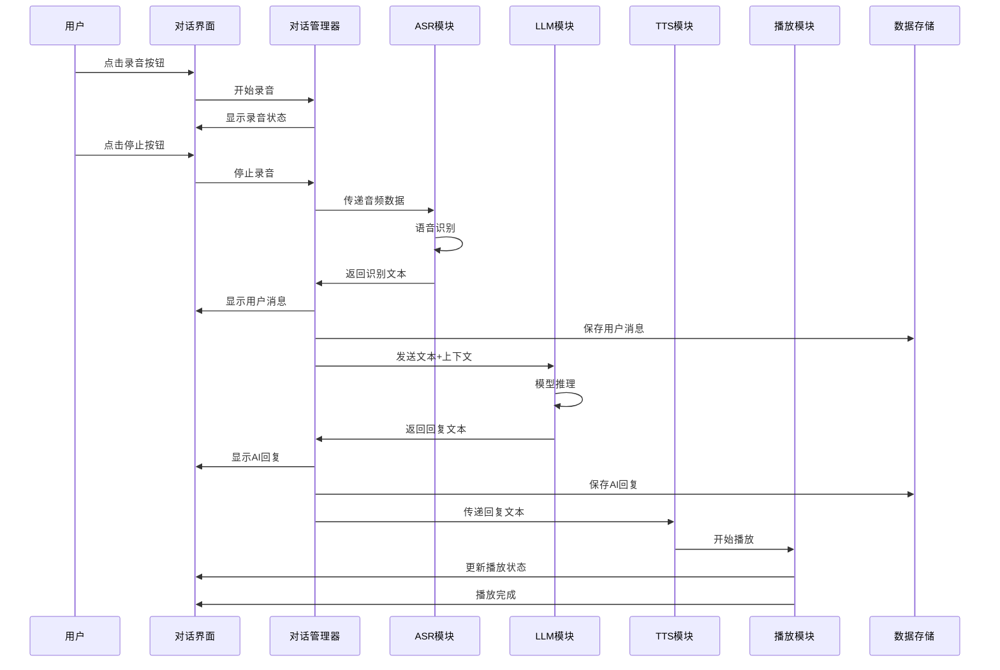
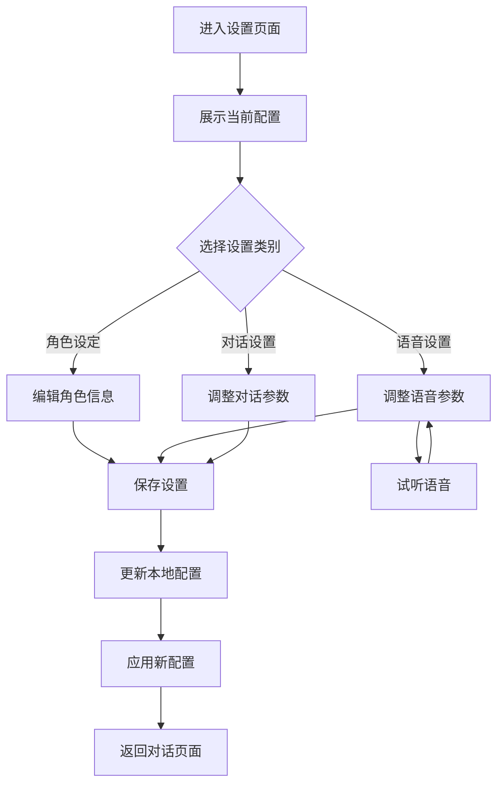
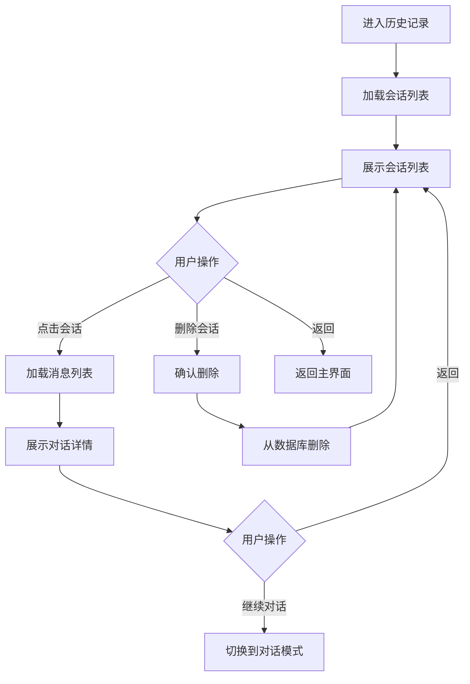

# iOS 智能对话应用设计文档

## 1. 项目概述

### 1.1 项目目标
构建一款智能对话iOS应用，用户通过语音与AI助手进行自然对话交互。语音识别在设备端离线完成，大模型推理通过云端API调用，实现高质量的对话体验。

### 1.2 核心价值
- 离线语音识别，快速响应
- 云端大模型推理，智能对话
- 端到端语音交互体验
- 可定制化的AI角色和语音
- 本地对话历史持久化

### 1.3 技术选型

| 技术领域 | 选型方案 | 说明 |
|---------|---------|------|
| 开发平台 | iOS 15.0+ | 支持主流设备 |
| 语音识别 | SenseVoice端到端模型 | 离线ASR，支持中英文 |
| 大语言模型 | 千问系列模型 | 通过HTTP API调用 |
| 语音合成 | iOS系统TTS | AVSpeechSynthesizer |
| 音频处理 | AVFoundation | 录音和播放 |
| 数据持久化 | Core Data / SQLite | 对话历史存储 |
| 模型推理 | Core ML | 端侧ASR模型运行 |
| 网络请求 | URLSession | API调用 |

## 2. 系统架构

### 2.1 整体架构

### 2.2 核心模块职责

| 模块名称 | 职责描述 |
|---------|---------|
| 对话管理器 | 协调整个对话流程，管理对话状态，串联各功能模块 |
| 音频采集模块 | 录制用户语音，处理音频缓冲，检测录音状态 |
| ASR处理模块 | 加载和管理SenseVoice模型，将音频转换为文本 |
| LLM推理模块 | 调用千问API，基于上下文生成回复，处理网络请求 |
| TTS处理模块 | 调用系统TTS引擎，将文本转换为语音 |
| 音频播放模块 | 播放TTS生成的语音，管理播放队列 |
| 设置管理器 | 管理角色设定、语音参数、API配置等 |
| 对话存储 | 持久化对话历史，支持查询和删除 |

## 3. 核心功能设计

### 3.1 音频采集功能

#### 功能描述
提供点击录音的交互方式，用户点击开始录音按钮后开始采集音频，再次点击结束录音按钮停止采集。

#### 关键设计点

| 设计维度 | 方案 |
|---------|------|
| 音频格式 | PCM 16kHz 16bit 单声道 |
| 采集引擎 | AVAudioEngine |
| 录音时长限制 | 最长60秒，防止内存溢出 |
| 静音检测 | 可选，连续静音超过2秒自动停止 |
| 录音状态 | 空闲、录音中、处理中三种状态 |
| 权限处理 | 首次使用请求麦克风权限 |

#### 数据流转

### 3.2 ASR处理功能

#### 功能描述
利用SenseVoice端到端模型将录制的音频转换为文本，支持中英文混合识别，输出带标点符号的文本结果。模型在设备端离线运行，无需网络连接。

#### 关键设计点

| 设计维度 | 方案 |
|---------|------|
| 模型加载时机 | 应用启动时预加载到内存 |
| 模型格式 | Core ML格式 |
| 输入预处理 | 音频重采样、归一化、特征提取 |
| 推理模式 | 异步推理，在后台线程执行 |
| 输出格式 | 纯文本字符串 |
| 离线运行 | 完全本地推理，不依赖网络 |
| 错误处理 | 识别失败时提示用户重新录音 |

#### 处理流程

### 3.3 LLM推理功能

#### 功能描述
通过HTTP API调用千问系列模型对用户输入的文本进行理解和生成回复，支持多轮对话上下文，根据角色设定调整回复风格。

#### 关键设计点

| 设计维度 | 方案 |
|---------|------|
| API方式 | HTTP RESTful API |
| 请求方式 | POST请求，JSON格式 |
| 上下文管理 | 维护最近N轮对话(如10轮) |
| 角色注入 | 通过System Prompt设定角色 |
| 推理策略 | 支持流式(SSE)或一次性生成 |
| Token限制 | 单次生成最大tokens由API限制 |
| 温度参数 | 可在设置中调整(0.7-1.0) |
| 超时设置 | 请求超时30秒 |
| 重试机制 | 失败后自动重试最多3次 |
| 网络异常 | 提示用户检查网络连接 |

#### 推理流程

### 3.4 TTS处理功能

#### 功能描述
使用iOS系统内置的AVSpeechSynthesizer将大模型生成的文本转换为语音输出。

#### 关键设计点

| 设计维度 | 方案 |
|---------|------|
| TTS引擎 | AVSpeechSynthesizer |
| 语音选择 | 支持中文和英文语音 |
| 语速控制 | 可在设置中调节(0.4-0.6倍速) |
| 音调控制 | 可在设置中调节(0.8-1.2) |
| 音量控制 | 可在设置中调节(0.5-1.0) |
| 文本预处理 | 处理特殊符号、表情等 |

#### 配置参数表

| 参数名称 | 默认值 | 可选范围 | 说明 |
|---------|-------|---------|------|
| 语音标识 | zh-CN | zh-CN, en-US等 | 语音类型 |
| 语速 | 0.5 | 0.4-0.6 | 播放速度 |
| 音调 | 1.0 | 0.8-1.2 | 音高 |
| 音量 | 1.0 | 0.5-1.0 | 音量大小 |

### 3.5 音频播放功能

#### 功能描述
播放TTS生成的语音，支持播放控制(暂停、继续、停止)，提供播放状态反馈。

#### 关键设计点

| 设计维度 | 方案 |
|---------|------|
| 播放控制 | 支持暂停、继续、停止 |
| 播放状态 | 空闲、播放中、暂停、已完成 |
| 播放模式 | 独占模式，播放时不可录音 |
| 中断处理 | 处理来电、闹钟等系统中断 |
| 后台播放 | 支持后台继续播放 |

#### 状态转换

### 3.6 设置功能

#### 功能描述
提供用户可配置的设置项，包括大模型角色设定和语音播放参数设置。

#### 设置项定义

| 设置分类 | 设置项 | 类型 | 默认值 | 说明 |
|---------|-------|------|-------|------|
| API设置 | API密钥 | 文本 | 空 | 千问API Key |
| API设置 | API地址 | 文本 | 默认地址 | API Endpoint |
| API设置 | 模型版本 | 选择 | qwen-turbo | 可选模型版本 |
| 角色设定 | 角色名称 | 文本 | 智能助手 | AI的角色名 |
| 角色设定 | 角色描述 | 文本 | 你是一个友好的AI助手 | System Prompt |
| 角色设定 | 性格特点 | 文本 | 友好、专业 | 影响回复风格 |
| 语音设置 | 语音类型 | 选择 | zh-CN | 中文或英文 |
| 语音设置 | 语速 | 滑块 | 0.5 | 0.4-0.6 |
| 语音设置 | 音调 | 滑块 | 1.0 | 0.8-1.2 |
| 语音设置 | 音量 | 滑块 | 1.0 | 0.5-1.0 |
| 对话设置 | 上下文轮数 | 数字 | 10 | 5-20轮 |
| 对话设置 | 生成温度 | 滑块 | 0.8 | 0.7-1.0 |
| 对话设置 | 最大tokens | 数字 | 2000 | 单次生成上限 |

## 4. 数据模型设计

### 4.1 对话会话实体

| 字段名 | 类型 | 必填 | 说明 |
|-------|------|------|------|
| sessionId | UUID | 是 | 会话唯一标识 |
| title | 字符串 | 是 | 会话标题(取首条消息摘要) |
| createTime | 时间戳 | 是 | 创建时间 |
| updateTime | 时间戳 | 是 | 最后更新时间 |
| messageCount | 整数 | 是 | 消息数量 |
| roleConfig | JSON | 否 | 该会话使用的角色配置 |

### 4.2 消息实体

| 字段名 | 类型 | 必填 | 说明 |
|-------|------|------|------|
| messageId | UUID | 是 | 消息唯一标识 |
| sessionId | UUID | 是 | 所属会话ID |
| role | 枚举 | 是 | user或assistant |
| contentType | 枚举 | 是 | text或audio |
| textContent | 字符串 | 是 | 文本内容 |
| audioPath | 字符串 | 否 | 音频文件路径 |
| createTime | 时间戳 | 是 | 创建时间 |
| duration | 浮点数 | 否 | 音频时长(秒) |

### 4.3 设置配置实体

| 字段名 | 类型 | 默认值 | 说明 |
|-------|------|-------|------|
| apiKey | 字符串 | 空 | 千问API密钥 |
| apiEndpoint | 字符串 | 默认地址 | API地址 |
| modelVersion | 字符串 | qwen-turbo | 模型版本 |
| roleName | 字符串 | 智能助手 | 角色名称 |
| rolePrompt | 字符串 | 默认Prompt | 角色System Prompt |
| voiceId | 字符串 | zh-CN | 语音标识 |
| speechRate | 浮点数 | 0.5 | 语速 |
| speechPitch | 浮点数 | 1.0 | 音调 |
| speechVolume | 浮点数 | 1.0 | 音量 |
| contextTurns | 整数 | 10 | 上下文轮数 |
| temperature | 浮点数 | 0.8 | 生成温度 |
| maxTokens | 整数 | 2000 | 最大生成tokens |

### 4.4 实体关系

## 5. 模型集成策略

### 5.1 SenseVoice模型管理

| 管理维度 | 策略 |
|---------|------|
| 打包方式 | 模型文件打包到App Bundle |
| 文件位置 | Resources目录下models子目录 |
| 文件格式 | Core ML格式(.mlmodel或.mlmodelc) |
| 版本管理 | 文件名包含版本号，支持后续升级 |
| 模型大小 | 约200-500MB |
| 离线运行 | 完全本地推理，不依赖网络 |

### 5.2 千问API集成

| 集成维度 | 方案 |
|---------|------|
| API协议 | HTTP/HTTPS RESTful API |
| 认证方式 | API Key认证 |
| 请求格式 | JSON |
| 响应格式 | JSON或SSE流式 |
| 模型选择 | 支持qwen-turbo、qwen-plus等 |
| 并发控制 | 单次单个请求，排队处理 |

### 5.3 SenseVoice加载策略

### 5.4 内存管理

| 管理维度 | 策略 |
|---------|------|
| 内存监控 | 监听系统内存警告 |
| 模型卸载 | 收到警告时卸载SenseVoice模型 |
| 模型重载 | 下次使用时重新加载 |
| 缓存策略 | 正常情况下SenseVoice常驻内存 |
| 推理优化 | 使用Neural Engine或GPU加速 |

### 5.5 性能优化

| 优化维度 | 方案 |
|---------|------|
| ASR优化 | 使用Core ML优化的模型 |
| 推理加速 | 启用Neural Engine加速 |
| 多线程 | ASR推理在后台线程执行 |
| 网络优化 | API请求使用URLSession，支持后台传输 |
| 预热策略 | 首次启动时预热ASR模型 |
| 批处理 | 音频特征提取批量处理 |
| 请求优化 | 复用HTTP连接，减少握手开销 |

## 6. 用户交互流程

### 6.1 完整对话流程

### 6.2 设置流程

### 6.3 对话历史查看流程

## 7. 技术考量

### 7.1 性能要求

| 性能指标 | 目标值 | 说明 |
|---------|-------|------|
| ASR识别延迟 | 小于2秒 | 录音结束到显示文本 |
| API请求延迟 | 小于3秒 | 首字响应时间(流式) |
| LLM完整响应 | 小于10秒 | 完整回复生成时间 |
| TTS合成延迟 | 小于1秒 | 文本到开始播放 |
| 应用启动时间 | 小于3秒 | 冷启动到界面可用 |
| 内存占用 | 小于500MB | 稳定运行时内存峰值 |

### 7.2 存储管理

| 存储项 | 策略 |
|-------|------|
| ASR模型文件 | 约200-500MB，打包在应用内 |
| 对话历史 | 使用Core Data，支持最多1000条会话 |
| 音频文件 | 可选保存，单个文件最大5MB |
| API响应缓存 | 可选缓存，使用NSCache |
| 缓存清理 | 支持手动清理历史记录和音频 |
| 自动清理 | 超过1000条会话时自动删除最旧记录 |

### 7.3 电量优化

| 优化维度 | 策略 |
|---------|------|
| ASR推理 | 优先使用Neural Engine，降低CPU占用 |
| 网络请求 | 合理设置超时，避免长时间等待 |
| 后台运行 | 非必要不在后台执行任务 |
| 屏幕常亮 | 录音和播放时可选保持屏幕常亮 |
| 动画优化 | 减少不必要的UI动画 |

### 7.4 错误处理

| 错误场景 | 处理策略 |
|---------|---------|
| 模型加载失败 | 提示用户重启应用，记录错误日志 |
| 麦克风权限拒绝 | 引导用户到设置页面开启权限 |
| 内存不足 | 卸载ASR模型，提示用户关闭其他应用 |
| 识别失败 | 提示用户重新说话，可切换为文本输入 |
| 网络不可用 | 提示用户检查网络连接 |
| API调用失败 | 显示错误信息，支持重试 |
| API认证失败 | 提示用户检查API密钥配置 |
| API超时 | 超过30秒取消请求，提示用户重试 |
| 播放中断 | 处理来电等中断，结束后自动恢复播放 |
| 存储失败 | 提示用户清理空间，降级为内存对话 |

### 7.5 隐私与安全

| 维度 | 策略 |
|------|------|
| 数据隐私 | 对话历史存储在本地，API调用需用户授权 |
| API安全 | 使用HTTPS加密传输，API密钥本地加密存储 |
| 录音隐私 | 录音文件可选加密存储 |
| 对话隐私 | 支持单条或批量删除对话 |
| 权限最小化 | 仅请求麦克风和网络权限 |
| 数据导出 | 支持导出对话历史为文本文件 |
| 密钥保护 | API密钥使用Keychain安全存储 |

## 8. 未来扩展方向

### 8.1 短期扩展

- 支持流式显示API响应结果
- 支持语音克隆，自定义TTS声音
- 支持多种大模型API切换
- 支持对话分享功能
- 支持暗黑模式
- 支持网络状态监控和提示

### 8.2 长期扩展

- 支持多模态输入(图片、文件)
- 支持实时对话(无需点击录音)
- 支持多语言识别和合成
- 支持云端同步(可选)
- 支持插件系统
- 支持离线缓存常用回复
