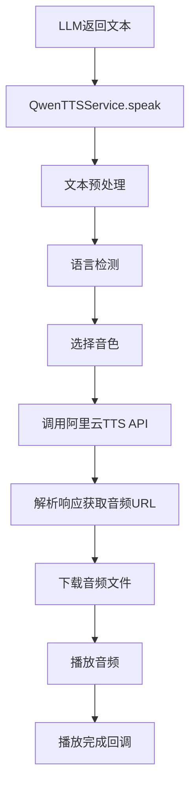

# Qwen3-TTS-Flash 集成文档

## 概述

TalkToYou 应用已集成阿里云 **Qwen3-TTS-Flash** 语音合成服务，替代了原有的 AVSpeechSynthesizer 本地语音合成方案，提供更自然、更流畅的语音播报体验。

## 特性

- ✅ **高质量语音合成**：使用阿里云通义千问最新的语音合成模型
- ✅ **多音色支持**：根据语言自动选择合适的音色
- ✅ **智能语言检测**：自动识别中英文并选择对应的语音参数
- ✅ **流式播放**：下载完成后立即播放，减少等待时间
- ✅ **错误处理**：完善的异常处理和用户友好的错误提示

## 文件结构

```
TalkToYou/Services/
├── TTSService.swift          # 原有的本地TTS服务（已弃用）
├── QwenTTSService.swift      # 新的阿里云TTS服务 ⭐
└── ConversationManager.swift # 已更新为使用QwenTTSService
```

## API 配置

### 1. 获取 API Key

访问 [阿里云百炼平台](https://bailian.console.aliyun.com/)：
1. 登录阿里云账号
2. 进入"百炼大模型"控制台
3. 在"API Key 管理"中创建新的 API Key
4. 复制 API Key（格式：`sk-xxx`）

### 2. 配置应用

在 TalkToYou App 的设置界面中：
1. 打开"设置"页面
2. 找到"API 配置"区域
3. 填入你的 API Key
4. API 地址保持默认：`https://dashscope.aliyuncs.com/api/v1/services/aigc/text-generation/generation`

## 技术实现

### 核心流程



### API 请求格式

```json
{
  "model": "qwen3-tts-flash",
  "input": {
    "text": "要合成的文本内容",
    "voice": "Cherry",
    "language_type": "Chinese"
  }
}
```

### API 响应格式

```json
{
  "output": {
    "audio_url": "https://xxx.oss-cn-beijing.aliyuncs.com/xxx.mp3"
  },
  "request_id": "xxx"
}
```

## 支持的音色

### 中文音色
- **Cherry** - 温柔自然女声（默认中文音色）⭐
- **Lily** - 活泼女声
- **Yoyo** - 甜美女声
- **Stella** - 知性女声
- **Luna** - 温暖女声

### 英文音色
- **Emily** - 自然女声（默认英文音色）⭐
- **Jenny** - 清新女声
- **Samantha** - 成熟女声
- **Cally** - 活力女声
- **Lydia** - 专业女声

### 方言音色
- **Sichuan** - 四川话
- **Cantonese** - 粤语
- **Dongbei** - 东北话
- **Taiwan** - 台湾国语
- **Shaanxi** - 陕西话
- **Chongqing** - 重庆话

## 语言检测逻辑

```swift
func detectLanguage(_ text: String) -> String {
    // 统计中文字符占比
    if chineseRatio > 0.5 {
        return "Chinese"
    }
    // 统计英文字符占比
    else if englishRatio > 0.5 {
        return "English"
    }
    // 混合文本使用自动检测
    else {
        return "Auto"
    }
}
```

## 使用方法

### 基本调用

```swift
let ttsService = QwenTTSService.shared

// 简单调用
ttsService.speak("你好，世界！")

// 带完成回调
ttsService.speak("Hello, World!") {
    print("播放完成")
}
```

### 控制播放

```swift
// 暂停
ttsService.pause()

// 恢复
ttsService.resume()

// 停止
ttsService.stop()

// 检查播放状态
if ttsService.isSpeaking {
    print("正在播放")
}
```

## 错误处理

服务会自动处理以下错误：

- ✅ 网络连接错误
- ✅ API 认证失败（API Key 错误）
- ✅ API 调用限流
- ✅ 服务器错误（自动重试）
- ✅ 音频下载失败
- ✅ 音频播放失败

所有错误都会通过日志输出，便于调试：

```
❌ [Qwen-TTS] 错误: API认证失败，请检查密钥配置
```

## 限制说明

1. **文本长度限制**：单次最多 600 字符（超出会自动截断）
2. **API 调用限流**：请注意阿里云的 QPS 限制
3. **网络依赖**：需要联网才能使用（不支持离线）

## 性能优化

- ✅ **异步处理**：使用 async/await 避免阻塞主线程
- ✅ **智能缓存**：音频数据在内存中播放，无需磁盘 I/O
- ✅ **音频会话管理**：智能切换播放/录音模式
- ✅ **资源清理**：播放完成后自动释放资源

## 调试日志

启用详细日志以便调试：

```
📝 [Qwen-TTS] 开始语音合成: 你好，世界！...
🌐 [Qwen-TTS] 检测到语言: Chinese
🎙️ [Qwen-TTS] 使用音色: Cherry
🔊 [Qwen-TTS] 音频会话已配置为播放模式
📤 [Qwen-TTS] 发送TTS请求...
📥 [Qwen-TTS] 收到响应，状态码: 200
🔗 [Qwen-TTS] 音频URL: https://xxx.oss-cn-beijing.aliyuncs.com/xxx.mp3
⬇️  [Qwen-TTS] 下载音频文件...
✅ [Qwen-TTS] 音频下载成功，大小: 12345 bytes
▶️  [Qwen-TTS] 开始播放音频，时长: 2.50秒
✅ [Qwen-TTS] 播放完成
```

## 与原有 TTSService 的区别

| 特性 | TTSService (原) | QwenTTSService (新) |
|------|-----------------|---------------------|
| 语音质量 | 系统合成，较机械 | AI 合成，更自然 |
| 音色选择 | 有限（系统音色） | 丰富（20+ 音色） |
| 语言支持 | 中英文基础支持 | 多语言+方言 |
| 网络依赖 | 离线可用 | 需要联网 |
| API 成本 | 免费 | 按调用量收费 |
| 响应速度 | 即时 | 网络延迟 ~1-2s |

## 常见问题

### Q: 为什么切换到云端 TTS？
A: 云端 TTS 提供更自然、更接近真人的语音质量，大幅提升用户体验。

### Q: 是否可以切回本地 TTS？
A: 可以。只需在 `ConversationManager.swift` 中将 `ttsService` 改回 `TTSService.shared` 即可。

### Q: 如何自定义音色？
A: 修改 `QwenTTSService.swift` 中的 `selectVoice(for:)` 方法，返回你想要的音色名称。

### Q: 如何处理长文本？
A: 服务会自动截断超过 600 字符的文本。如需处理长文本，建议在 LLM 层面控制回复长度。

## 参考文档

- [阿里云 Qwen-TTS API 文档](https://help.aliyun.com/zh/model-studio/qwen-tts-api)
- [通义千问语音合成模型](https://help.aliyun.com/zh/model-studio/qwen-tts)
- [阿里云百炼控制台](https://bailian.console.aliyun.com/)

## 更新日志

### v1.0.0 (2025-11-02)
- ✅ 首次集成 Qwen3-TTS-Flash
- ✅ 支持中英文智能语言检测
- ✅ 支持多种音色自动选择
- ✅ 完善的错误处理机制
- ✅ 详细的调试日志输出
